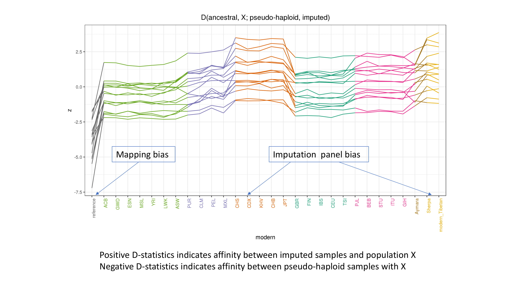

# aDNA-IMP
Pipeline for aDNA imputation with GeneImp, and scripts for analyzing accuracy and bias

I visualize imputation bias with z-scores of f4(ancestral, X; pseudo-haloid ancient, imputed diploid ancient), where X is a present-day population in the reference panel. A significantly positive z-score indicates that the imputed ancient genotypes are biased toward the reference population X. In this example, I'm imputing ancient individuals from Nepal. There is clear biases with East Asian populations as references. 

Visualization inspired by Martiniano R, Cassidy LM, Ó'Maoldúin R, McLaughlin R, Silva NM, Manco L, et al. (2017) The population genomics of archaeological transition in west Iberia: Investigation of ancient substructure using imputation and haplotype-based methods. PLoS Genet 13(7): e1006852. https://doi.org/10.1371/journal.pgen.1006852

